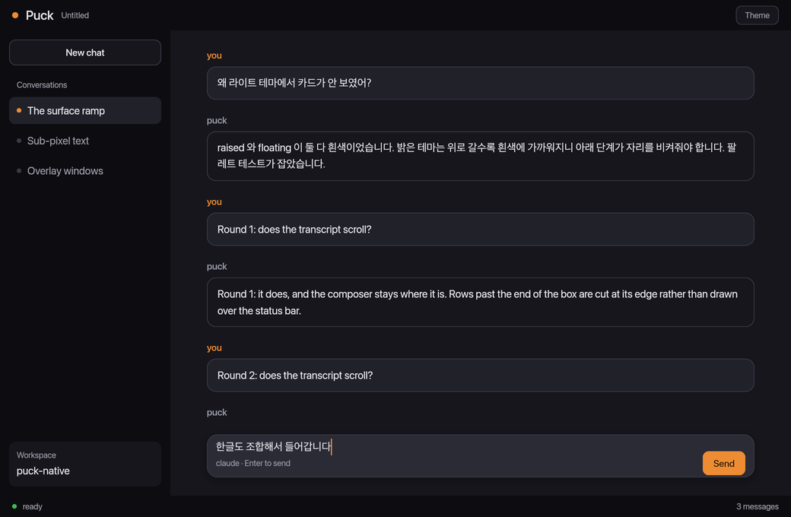

# wisp

A GPU user interface toolkit in Rust, built around the window every other
toolkit treats as an afterthought: one that is **transparent**, **always on
top**, lets clicks through every pixel its content is not drawn on, **moves
with that content**, and is paced by the display rather than by a timer.

The core underneath it is general purpose. The overlay case is what it is
for.

> **Status: early, and it does the thing it is named for.** Layout, text,
> typing in any language, scrolling, pointer input, a design system, and
> transparent always-on-top windows that let clicks through wherever nothing is
> drawn. See [Where this is](#where-this-is) for what is not here.



Every pixel of that is this library: the layout, the type scale and surface
ramp, the rounded boxes, the text, and the caret sitting inside a Hangul
syllable that is still being composed. It was not photographed from a screen --
`cargo run --example shot` renders it to a PNG with no window at all, which is
also how the renderer is tested.

```sh
cargo run --example chat -p wisp      # a chat window, built out of the toolkit
cargo run --example gallery -p wisp   # the type scale and the surface ramp
cargo run --example overlay -p wisp   # a card over your desktop that clicks fall through
```

`cargo run --example overlay -- --selftest` asks the window server whether the
overlay behaves, and quits:

```
=== wisp overlay selftest (window 125255) ===
1. the frame has something and nothing on it -> PASS
2. a click where something is drawn reaches this window -> PASS (reached=true)
3. a click where nothing is drawn passes through       -> PASS (reached=false)
=== all checks passed ===
```

Checks 2 and 3 are the whole library in two lines. They are not the overlay
reading its own flags back -- that would pass on a window the compositor is
quietly ignoring. They warp the real cursor onto a drawn pixel and then onto a
transparent one and ask the window server which window a click there would
actually hit, which is an answer that crosses application boundaries and cannot
be faked from inside.

115 tests.

## Why another one

Every Rust GUI toolkit assumes it owns a rectangle the operating system handed
it. That assumption is invisible until you want a character walking across
someone's desktop, a heads-up display over a game, a floating palette, or a
notification that is not a window-shaped box — and then it is in the way at
every level, from hit testing to the blend mode.

The awkward parts of that case are not obvious, and they are what this library
is made of. They were found the expensive way, in a desktop pet that shipped
each of these bugs first:

- **Positions are fractional, always.** A toolkit that floors an image's origin
  to a whole device pixel cannot move anything smoothly. It is not a rounding
  error you squint at; it is a visible stutter in anything that drifts slowly.
- **Points and device pixels are different types here.** Both are `f32` and only
  a name keeps them apart, so a doubled conversion does not crash — it draws at
  half size in the wrong quarter of the window. That shipped twice, in two
  files, written by someone who knew the difference.
- **Colours mix in Oklab.** Two colours averaged channel-wise in sRGB pass
  through a muddy band; blue to yellow goes grey.
- **The blend is premultiplied throughout.** Straight alpha darkens every
  antialiased edge against a transparent background, which is the only kind of
  background this library assumes.

## Where this is

| | |
|---|---|
| geometry, colour, the display list | **done** — `wisp-core`, no GPU or platform in it |
| the renderer: rounded rects, borders, gradients, shadows, glyphs | **done** — one signed-distance field per quad, and a coverage atlas for everything cached. 12 tests render and read the pixels back |
| a window, and a frame paced by the surface | **done** — `wisp::run` |
| text | **shaping, a glyph cache and an atlas** — `wisp-text`, on `cosmic-text` and `swash`. No shaper of its own and there will not be one |
| layout | **done** — flexbox on `taffy`, with `Fill` meaning *the space that is left* along an axis and *all of it* across one, which is the distinction a sidebar beside a pane lives or dies on |
| a design system | **done** — a named type scale and surface ramp, with tests that neighbouring steps stay far enough apart to be seen. Most toolkits leave this to the application and most applications never get to it |
| pointer input | **done** — hover, press and click, hit-tested against the frame that was drawn. A click is a press and a release on the same box, so sliding off one and letting go cancels |
| text entry, focus, IME | **done** — a grapheme-aware editor, click to focus, and composition through the system's input method, so Korean, Japanese and Chinese all work without this library composing anything itself |
| scrolling | **done** — a box that keeps its size, cuts what reaches past it, and takes the wheel from whichever scrolling box the pointer is over |
| pictures | **done** — an atlas for avatars, icons and sprites, tinted on the way out so one white icon serves every colour |
| the overlay: transparent, always on top, click-through per pixel | **done** on macOS — `wisp-overlay`, with a selftest that asks the window server rather than reading back its own flags |

The milestone that decides whether any of this worked is porting a real desktop
pet onto it. Everything above is what that port needs and nothing above has
carried one yet, so read the table as "written, tested, and not yet proven by
the thing it was written for".

## How it fits together

| crate | what it is | depends on |
|---|---|---|
| `wisp-core` | geometry, colour, the display list | nothing |
| `wisp-gpu` | the wgpu renderer | `wisp-core`, `wgpu` |
| `wisp-text` | shaping, rasterising, the glyph atlas | `wisp-core`, `cosmic-text` |
| `wisp-ui` | layout, input, editing, the design system | `wisp-core`, `wisp-text`, `taffy` |
| `wisp-overlay` | transparent, always-on-top, click-through windows | `wisp-core`, AppKit |
| `wisp` | the window, and the umbrella re-export | all of them |

`wisp-core` has no GPU and no platform in it, which is why nearly every test
can run anywhere and in milliseconds.

## Building a window

```rust
use wisp::{Edges, Elevation, Role, Sizing, Theme, Ui, WindowOptions, column, row, text};

let theme = Theme::dark();
wisp::run(WindowOptions::default(), move |ui: &mut Ui, _frame| {
    if ui.last().clicked("send") {
        // ...
    }
    column()
        .size(Sizing::Fill, Sizing::Fill)
        .padding(Edges::all(24.0))
        .gap(12.0)
        .background(theme.base)
        .child(text("Say something", Role::Title, theme.ink))
        .child(
            row()
                .padding(Edges::axes(8.0, 16.0))
                .corners(8.0)
                .background(theme.accent)
                .id("send")
                .child(text("Send", Role::Label, theme.on_accent)),
        )
})
```

The tree is rebuilt every frame and nothing in it remembers anything. A button
is a box with a name; whether it was clicked is a question about the frame that
has already been drawn. There is no widget state to keep in step with the
application's own, which is the bug retained toolkits spend their lives on.

A rounded rectangle with a border and a shadow is one primitive, evaluated
once. Drawing a box and then its border as two quads is where the seam between
them comes from, and a shadow drawn as its own quad has a hard edge exactly
where it meets the thing casting it.

## Testing

```sh
cargo test --workspace
```

The renderer's tests draw to a texture and read the pixels back, because WGSL
is compiled by the driver at run time and a storage buffer's layout is agreed
by convention rather than by a compiler: a shader with a typo in it builds
perfectly and draws the wrong thing somewhere else in the frame. They skip
rather than fail where there is no adapter.

One of them is there because the first eight were not enough. They were written
with pure colours — `0x00` and `0xff` — which are the fixed points of the sRGB
transfer function, so they passed whether or not colours were linearised on the
way to the GPU. The window was rendering every mid-tone about twice as light as
it should and the suite stayed green. That was found by looking at it.

## License

MIT for the source. Not for artwork, fonts or audio distributed alongside it —
see [LICENSE-ASSETS.md](LICENSE-ASSETS.md).
